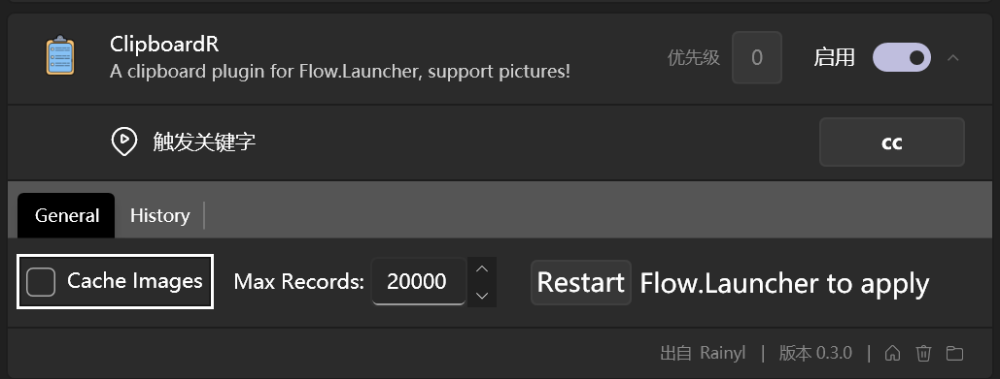
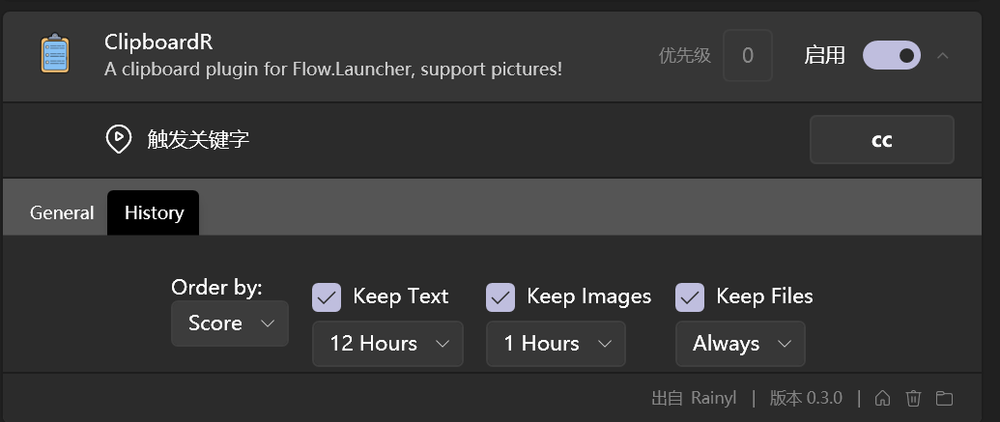

# Archived            

Flow.launcher is awesome but I only need `everything` and `clipboard manager`, however the plugin `Clipboard History` didn't update for a long time and the support of image was lost, that's why I started this project.

However, developing plugins for `Flow.Launcher` via `C#` is kind of painful, until 2024.8.25, they still doesn't support change log level https://github.com/Flow-Launcher/Flow.Launcher/issues/2317 , which means I have to `1. build the plugin 2. copy to plugin directory 3. restart Flow` AND use system toast to show debug messages every time the source code was changed, so finally I lost my passion on it.

And the most importantly, I haven't use Flow for a long time ([EverythingToolbar](https://github.com/srwi/EverythingToolbar) and [ditto](https://github.com/sabrogden/Ditto) are great alternatives), that's why I didn't reply all the issues, my apologize.

Finally, I dicide to archive this repo, feel free to use my code in further development, that's the beauty of open source, just remember to refer to this repo. For those who want to get update, check [ClipboardPlus](https://github.com/Jack251970/Flow.Launcher.Plugin.ClipboardPlus), which is developed based on this plugin and you can switch to it easily. (I have noticed that it is 200+ commits ahead of my repo, plugin development for Flow is really not convenient enough ☹️)

Also, thanks for all your support! Bye.   

Best wishes.  
Rainyl
2024.8.25

# Flow Launcher Clipboard Plugin

The Clipboard plugin for [Flow.Launcher](https://github.com/Flow-Launcher/Flow.Launcher)

Give me a star :star: if you like this project~

## About

This Project is developed on the shoulders of giant:

Original Repo: [Wox.Plugin.ClipboardManager](https://github.com/Wox-launcher/Wox.Plugin.ClipboardManager)

Ported to Flow.Launcher: [Flow.Launcher.Plugin.ClipboardHistory](https://github.com/liberize/Flow.Launcher.Plugin.ClipboardHistory)

## Features

- Preview panel, support images
- Copy & delete & pin record
- Cache images supported
- Manually save images
- Persistent & Keep time settings
- Clear records in memory only or clear database
- Words count

## Installation

### Using release

1. Downlaod zip file from [Release](https://github.com/rainyl/Flow.Launcher.Plugin.ClipboardR/releases)
2. Place the contents of the Release zip in your %appdata%/FlowLauncher/Plugins folder and **restart**  FlowLauncher.

### Using plugin store

Now you can install it using plugin store!

1. Install: `pm install ClipboardR`
2. Update: `pm update ClipboardR`

## Usage

The default keyword is `clipboardr`, you can change it in the FlowLauncher settings.

Click `Copy` or directly the `search result` to copy the current data to clipboard, click `Delete` to delete the record.

If you want to save images in your clipboard, open the `CacheImages` option in settings.

Note: It is recommended to cache images using `CacheImages` option, saving large images
via `KeepImage` to database may block query for a little while.

## Todo List

- [x] Save images manually
- [x] Persistent
- [x] Keep time
- [x] Word Count
- [ ] Cached images format definition
- [ ] Image OCR

## Acknowledgement

- [IconFont](https://www.iconfont.cn)

## License

[Apache License V2.0](LICENSE)
